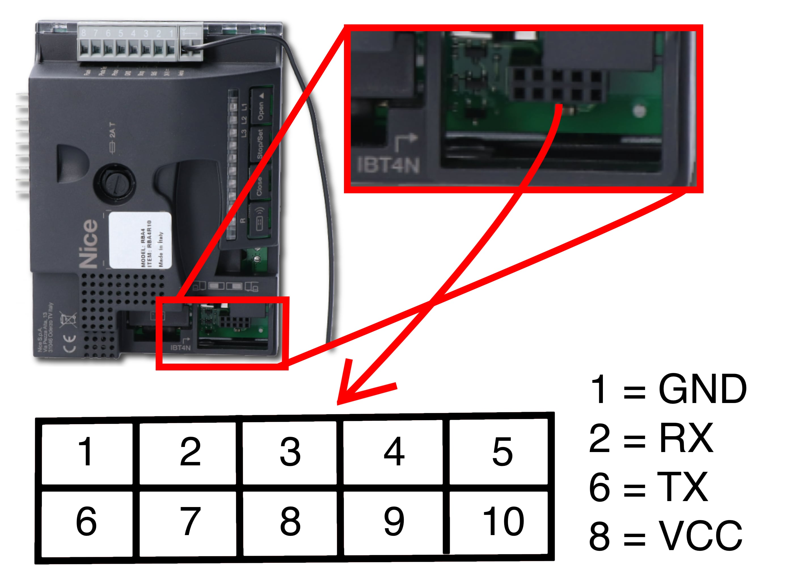
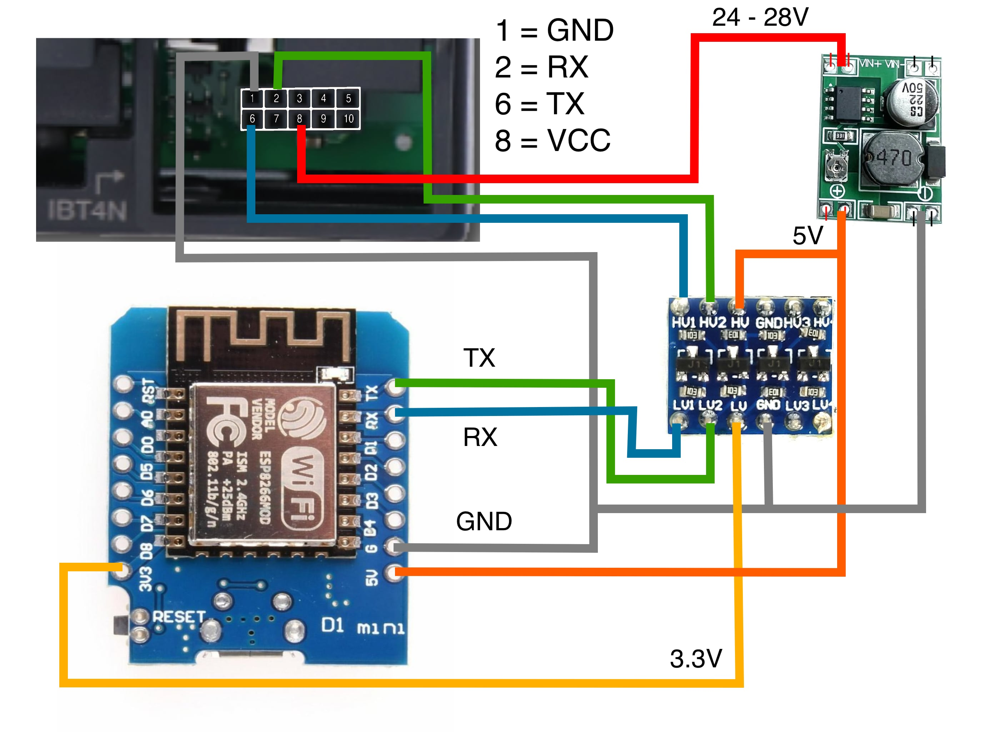

Russian translation available
[Russian](https://github.com/pruwait/Nice_BusT4)

# ESPHOME component to control Nice drives via Bus T4 protocol
# Nice Bus T4 protocol

Allowes ESP8266 to communicate with Nice gate/garage openers using the Bus T4 port.
Nice controll board must be equipped with BusT4 connector.

# Current capabilities
* Sending commands: "Open", "Stop", "Close", "Partial opening", "Step by step (SBS)" and others via buttons.
* Sending arbitrary HEX commands via the "raw_command" service. Byte separators can be periods or spaces. Example: 55 0c 00 03 00 81 01 05 86 01 82 01 64 e6 0c or 55.0D.00.FF.00.66.08.06.97.00.04.99.00.00.9D.0D
* Formation and sending of arbitrary GET/SET requests through the "send_inf_command" service. Allows you to configure the device or get its status.
* Display packets from all devices in the BusT4 network.
* Tested with Wingo5000 with MCA5 block, Robus RB500HS, SO2000, Road 400, DPRO924.

# BusT4:
This is a modified UART 19200 8n1 with a uart break duration of 519us-590us before each burst.
You can connect several devices; for this, CAN-BUS transceivers are added to the physical layer.
Physical transmission often occurs through CAN transceivers, but there are no CAN frames.



BusT4 RX/TX are running on 5V. ESP8266 RX/TX are using 3.3V - level shifter must be used!
BusT4 VCC pin provides power with voltage in range of 24V to 28V.
Take extra care to follow the correct pinout - incorrect wiring to the BusT4 can immediately kill you Nice control board. Manually check voltage on the VCC port before connecting to the unit!



The component supports sending an arbitrary command to the drive via the ESPHome service:
```
SBS:   55 0c 00 03 00 81 01 05 86 01 82 01 64 e6 0c
Open:  55 0c 00 03 05 81 01 05 83 01 82 03 64 e4 0c
Close: 55 0c 00 03 05 81 01 05 83 01 82 04 64 e3 0c
Stop:  55 0c 00 03 00 81 01 05 86 01 82 02 64 e5 0c
```

Original version available at https://github.com/pruwait/Nice_BusT4, most of credit goes to `@pruwait`.
